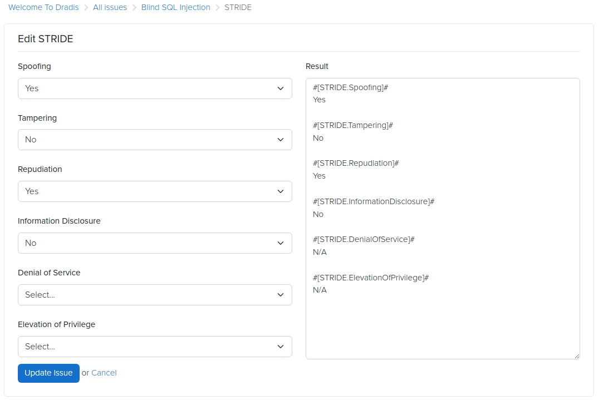

# STRIDE addon for Dradis

This simple addon adds a STRIDE threat modeling calculator to Dradis.

It introduces a new **STRIDE** tab in the Issue view, allowing you to quickly assess the presence of the six STRIDE threat categories using simple **Yes / No** selections. The results are stored directly in Issue fields.

## What is STRIDE?

STRIDE is a threat modeling framework that categorizes threats into six classes:

- **Spoofing**
- **Tampering**
- **Repudiation**
- **Information Disclosure**
- **Denial of Service**
- **Elevation of Privilege**

[STRIDE](https://learn.microsoft.com/en-us/previous-versions/commerce-server/ee823878(v=cs.20)) is commonly used during design reviews, architecture assessments, and application threat modeling to systematically reason about security risks.

The add-on requires [Dradis CE](https://dradis.com/ce/) > 3.0, or [Dradis Pro](https://dradis.com/).

## Install

Add this to your `Gemfile.plugins`:

    gem 'dradis-calculator_stride'

And

    bundle install

Restart your Dradis server and you should be good to go.

## More information

See the Dradis Framework's [README.md](https://github.com/dradis/dradis-ce/blob/develop/README.md)

## Contributing

See the Dradis Framework's [CONTRIBUTING.md](https://github.com/dradis/dradis-ce/blob/develop/CONTRIBUTING.md)

## License

Dradis Framework and all its components are released under [GNU General Public License version 2.0](http://www.gnu.org/licenses/old-licenses/gpl-2.0.html) as published by the Free Software Foundation and appearing in the file LICENSE included in the packaging of this file.

## Feature requests and bugs

Please use the [Dradis Framework issue tracker](https://github.com/dradis/dradis-ce/issues) for add-on improvements and bug reports.
